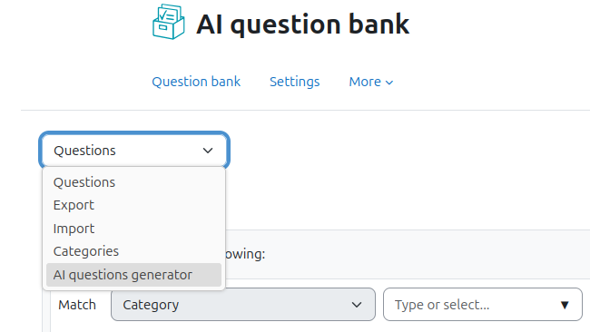
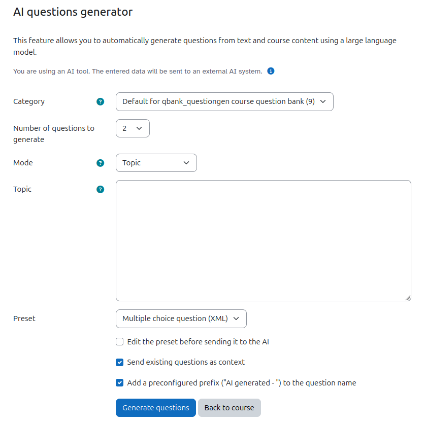

# AI question generator #

This plugin allows you to automatically create questions using a large language model. It currently requires the local_ai_manager plugin (https://github.com/mebis-lp/moodle-local_ai_manager) that manages the connection to the external AI system. It's a fork of the "AI Text to questions generator" created byt Yedidia Klein and Ruthy Salomon.

The plugin is in an alpha to beta stadium right now.

# Features
* The plugin basically does a lot of preprompting for the user to generate a Moodle XML question that instantly is being imported into the question bank.
* How this XML is being generated can be customized by the admin as well as the user. The admin will be able to configure presets that the user can "just use". A set of presets is being shipped with the plugin.
* The user can select between three modes
  * *Topic:* Specify a short topic that the questions should be about. The external AI system will generate questions related to this topic by using its owning training data.
  * *Story:* Specify the data from which the external AI system should generate questions from. This can be whole wikipedia articles. The user can paste in whatever content he/she wants the AI system to use. The AI system is being advised not to use any information besides the one provided by the user in this mode.
  * *Course contents:* Select activities from your course the plugin should extract the content from. Currently supported are:
    * Text and media area
    * Page
    * File
    * Folder
    * Lesson
    * Book
    * maybe more to come...

    The plugin will extract the text from these activities and send them to the AI system as context to generate questions from. This will typically not respect embedded images or PDF files.
  
    **File and folder activities are currently supported for files with image file type and PDF. For being able to use "File" or "Folder" activitites you will have to configure an AI tool in the local_ai_manager for "image to text" purpose.** The files will be sent to the external AI system that will extract the text. If the external AI system does not support PDF, the PDF will be converted into images first by using the code in assignsubmission_editpdf. As the extraction of information from PDF (especially multipage PDFs) can be expensive regarding token usage, the extracted text is being cached in a separate table, so the text extraction is only being done once for a file in the moodle file system.
* In the question generation form the user can choose if he/she wants to send existing questions from the question bank as context to the external AI system. In this case the AI system is being advised to generate **different** questions from the ones being provided. Only the question title and question text are being passed to the AI system in this case.
* The admin can define a prefix that should be added to the title of the questions. The user will be able to enable/disable this feature.
* If the admin defines a tag, the generated questions will also be tagged with this tag. The user cannot overwrite this setting.
* Question generation with AI can be tricky and can take some time. Therefore, all generation actions are being done by adhoc tasks in the background. However, the user will see a status bar and receive feedback what's going on.
* As LLM do not really "understand" Moodle XML and just work with examples and "generate something similiar" the background processes will try to parse the generated XML up to a configurable number of times. If no parseable question is being generated, this will be feedbacked to the user. Adhoc tasks are never being retried, also not on failure. The user will have to start a new question generation.
* The table `qbank_questiongen` contains all the question generation processes (one question each line). Admins with access to the database can use this to debug problems. A cleanup job will clean up the entries after a configurable delay.

## Care ##
Question generation, especially if provided a lot of content, can use a lot of tokens. Currently, there is no limit for the users. You will have to have an eye on the token usage if you are the one that has to pay it.

Also, this feature should be used responsibly in terms of resource consumption.

## Fork ##

This plugin is a (renamed) fork of https://github.com/yedidiaklein/moodle-local_aiquestions.

Thank you very much for providing the initial idea and code base.

## License ##

2025, ISB Bayern
Lead developer: Philipp Memmel <philipp.memmel@isb.bayern.de>

This program is free software: you can redistribute it and/or modify it under
the terms of the GNU General Public License as published by the Free Software
Foundation, either version 3 of the License, or (at your option) any later
version.

This program is distributed in the hope that it will be useful, but WITHOUT ANY
WARRANTY; without even the implied warranty of MERCHANTABILITY or FITNESS FOR A
PARTICULAR PURPOSE.  See the GNU General Public License for more details.

You should have received a copy of the GNU General Public License along with
this program.  If not, see <https://www.gnu.org/licenses/>.
